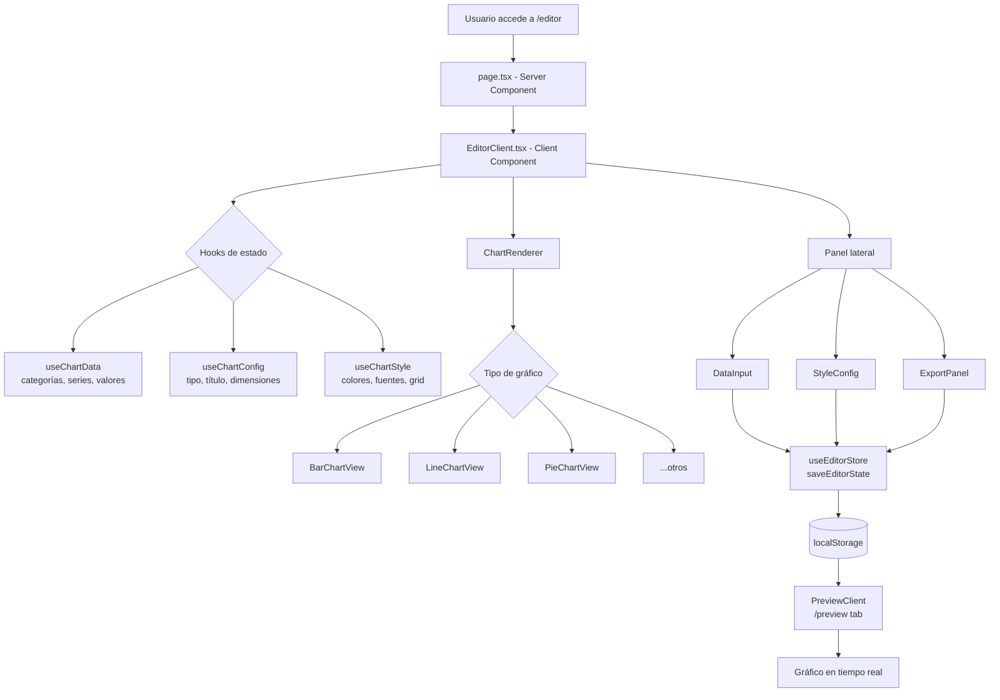
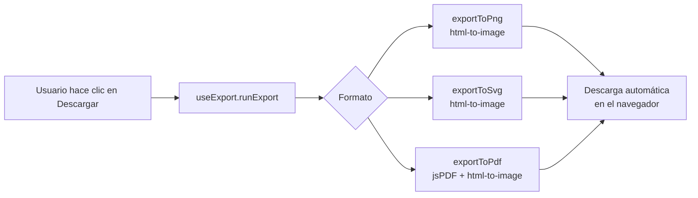

# Arquitectura del Proyecto — ChartForge

## Estructura de Carpetas

```
generacion-graficos/
├── src/
│   ├── app/                          # Next.js App Router
│   │   ├── layout.tsx               # Layout raíz con metadatos, fuentes y ThemeProvider
│   │   ├── page.tsx                 # Landing page (Server Component)
│   │   ├── LandingHeader.tsx        # Header de la página principal
│   │   ├── globals.css              # Variables CSS globales y tema dark/light
│   │   ├── editor/
│   │   │   ├── page.tsx            # Server Component wrapper (metadata del editor)
│   │   │   ├── EditorClient.tsx    # Componente principal del editor (Client Component)
│   │   │   └── editor.module.css   # Estilos del editor
│   │   └── preview/
│   │       ├── page.tsx            # Servidor Component wrapper
│   │       ├── PreviewClient.tsx   # Vista previa con sincronización en vivo
│   │       └── preview.module.css
│   │
│   ├── components/
│   │   ├── charts/                  # Componentes de renderizado de gráficos
│   │   │   ├── ChartRenderer/      # Enrutador por tipo de gráfico
│   │   │   ├── BarChartView/       # Barras verticales, horizontales, apiladas, agrupadas
│   │   │   ├── LineChartView/      # Gráfico de líneas
│   │   │   ├── AreaChartView/      # Gráfico de área
│   │   │   ├── PieChartView/       # Torta y anillo (doughnut)
│   │   │   ├── RadarChartView/     # Radar multivariable
│   │   │   ├── ComposedChartView/  # Gráfico mixto (barras + líneas)
│   │   │   ├── PyramidChartView/   # Pirámide poblacional (espejo)
│   │   │   ├── shared.ts           # Utilidades compartidas entre gráficos
│   │   │   └── index.ts
│   │   │
│   │   ├── panels/                  # Paneles de configuración del editor
│   │   │   ├── DataInput/          # Editor de tabla de datos
│   │   │   ├── StyleConfig/        # Colores, fuentes, grid, leyenda
│   │   │   ├── ExportPanel/        # Opciones de descarga
│   │   │   └── index.ts
│   │   │
│   │   └── ui/                      # Componentes base reutilizables
│   │       ├── Button/
│   │       ├── Input/
│   │       ├── NumberInput/
│   │       ├── Select/
│   │       ├── Toggle/
│   │       ├── Slider/
│   │       ├── ColorPicker/
│   │       ├── Tabs/
│   │       ├── ThemeProvider/      # Contexto dark/light mode
│   │       ├── ThemeToggle/
│   │       └── index.ts
│   │
│   ├── hooks/                       # React Hooks personalizados
│   │   ├── useChartData.ts         # Estado de categorías, series y valores
│   │   ├── useChartConfig.ts       # Estado de tipo, título y dimensiones
│   │   ├── useChartStyle.ts        # Estado de colores, fuentes y grid
│   │   ├── useExport.ts            # Lógica de exportación PNG/SVG/PDF
│   │   ├── useEditorStore.ts       # Sincronización con localStorage
│   │   ├── useTheme.ts             # Dark/Light mode con persistencia
│   │   ├── useDebounce.ts          # Debounce para inputs numéricos
│   │   └── index.ts
│   │
│   ├── constants/                   # Datos inmutables de configuración
│   │   ├── chartTypes.ts           # Definición de los 11 tipos de gráfico
│   │   ├── colorPalettes.ts        # 8 paletas de color prediseñadas
│   │   ├── fontOptions.ts          # 8 familias tipográficas disponibles
│   │   └── index.ts
│   │
│   ├── types/                       # Definiciones TypeScript
│   │   ├── chart.ts                # ChartType, ChartData, ChartConfig, ChartStyle
│   │   ├── export.ts               # ExportFormat, ExportOptions
│   │   └── index.ts
│   │
│   └── utils/                       # Funciones puras
│       ├── defaults.ts             # Datos por defecto y ejemplos por tipo
│       ├── export.ts               # exportToPng, exportToSvg, exportToPdf
│       ├── colors.ts               # Manipulación de HEX, RGB, opacidad
│       ├── validators.ts           # Validaciones de entrada de datos
│       └── index.ts
│
├── public/                          # Activos estáticos
├── next.config.ts                   # Configuración de Next.js
├── tsconfig.json                    # Configuración TypeScript
├── package.json
└── docs/
```

---

## Patrón Arquitectónico

**Arquitectura de Componentes con separación Server/Client (Next.js App Router)**

El proyecto sigue la convención de Next.js 16 con App Router, separando explícitamente los **Server Components** (generación de metadata, layout) de los **Client Components** (interactividad, hooks, estado).

- **Server Components** (`page.tsx`): Generan metadatos SEO y actúan como wrappers estáticos.
- **Client Components** (`*Client.tsx`): Contienen toda la lógica interactiva con `"use client"`.
- **Sin backend**: La aplicación es 100% estática. No existen API routes, base de datos ni servidor de aplicación.

---

## Capas y Responsabilidades

| Capa | Ubicación | Responsabilidad |
|------|-----------|-----------------|
| **Presentación** | `src/app/`, `src/components/ui/` | Rutas, layouts, componentes base de UI |
| **Gráficos** | `src/components/charts/` | Renderizado SVG vía Recharts por cada tipo |
| **Paneles** | `src/components/panels/` | Configuración de datos, estilos y exportación |
| **Estado** | `src/hooks/` | useState encapsulado por dominio (datos, config, estilos) |
| **Persistencia** | `useEditorStore.ts` | Lectura/escritura en localStorage; IPC entre pestañas |
| **Exportación** | `src/utils/export.ts` | Conversión DOM → PNG/SVG/PDF |
| **Constantes** | `src/constants/` | Tipos de gráfico, paletas y fuentes disponibles |
| **Tipos** | `src/types/` | Contratos TypeScript compartidos entre todas las capas |

---

## Flujo de una Petición Típica



**Flujo de exportación:**



---

## Tecnologías y Librerías Clave

| Tecnología | Versión | Rol Arquitectónico |
|------------|---------|-------------------|
| **Next.js** | 16.2.1 | Framework principal — App Router, Server/Client split, optimización de build |
| **React** | 19.2.4 | Motor de componentes — hooks, context, re-renders |
| **TypeScript** | 5 | Tipado estático — contratos entre capas |
| **Recharts** | 3.8.1 | Renderizado SVG de gráficos — ResponsiveContainer, todos los tipos base |
| **html-to-image** | 1.11.13 | Serialización DOM → PNG/SVG para exportación |
| **jsPDF** | 4.2.1 | Generación de PDF a partir de imagen capturada |
| **react-colorful** | 5.6.1 | Selector de color HEX para personalización de series |
| **Lucide React** | 1.7.0 | Iconografía SVG del sistema de UI |

---

## Manejo de Estado

El proyecto **no usa Redux, Zustand ni Context API** para el estado del editor. Utiliza hooks locales encapsulados por dominio:

| Hook | Estado que gestiona |
|------|---------------------|
| `useChartData` | Categorías, series y matriz de valores |
| `useChartConfig` | Tipo de gráfico, título, subtítulo, dimensiones, opciones de visualización |
| `useChartStyle` | Paleta de colores, familia tipográfica, tamaños, colores de texto, grid, leyenda |
| `useTheme` | Tema dark/light con persistencia en localStorage |

**Sincronización entre pestañas** (`useEditorStore`):
- El editor serializa el estado completo en `localStorage` bajo la clave `chartforge_editor_state`.
- La vista de previsualización (`/preview`) escucha el evento `storage` del navegador para recibir actualizaciones en tiempo real sin necesidad de WebSockets.

---

## Estrategia de Acceso a Datos

*No se encontró evidencia de acceso a base de datos, ORM ni API externa en el proyecto.*

Toda la persistencia ocurre en el navegador:
- **localStorage**: Estado del editor y preferencia de tema.
- **StorageEvent**: Canal de comunicación entre pestañas del mismo origen.
- Los datos del gráfico son efímeros y no se sincronizan con ningún servidor.
