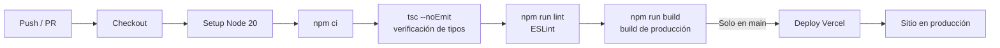

# CI/CD — ChartForge

## Estado Actual

*No se encontró evidencia de pipelines de CI/CD configurados en el proyecto.*

No existe ningún directorio `.github/workflows/`, `.gitlab-ci.yml`, `azure-pipelines.yml` ni equivalente en el repositorio.

---

## Pipeline Sugerido

Dado que el proyecto usa **Next.js + TypeScript** y se despliega como sitio estático, el pipeline recomendado es con **GitHub Actions** desplegando a **Vercel**.

### Estructura sugerida

```
.github/
└── workflows/
    ├── ci.yml       # Validación en cada PR (lint + type-check)
    └── deploy.yml   # Despliegue a producción en push a main
```

---

### `ci.yml` — Validación de Pull Requests

```yaml
name: CI

on:
  pull_request:
    branches: [main]

jobs:
  validate:
    name: Lint y verificación de tipos
    runs-on: ubuntu-latest

    steps:
      - name: Checkout del código
        uses: actions/checkout@v4

      - name: Configurar Node.js
        uses: actions/setup-node@v4
        with:
          node-version: '20'
          cache: 'npm'

      - name: Instalar dependencias
        run: npm ci

      - name: Verificar tipos TypeScript
        run: npx tsc --noEmit

      - name: Ejecutar ESLint
        run: npm run lint

      - name: Build de prueba
        run: npm run build
```

**Disparador**: Cualquier Pull Request hacia `main`.  
**Propósito**: Detectar errores de tipo, lint y build antes de fusionar.

---

### `deploy.yml` — Despliegue a Producción (Vercel)

```yaml
name: Deploy a Producción

on:
  push:
    branches: [main]

jobs:
  deploy:
    name: Despliegue en Vercel
    runs-on: ubuntu-latest

    steps:
      - name: Checkout del código
        uses: actions/checkout@v4

      - name: Configurar Node.js
        uses: actions/setup-node@v4
        with:
          node-version: '20'
          cache: 'npm'

      - name: Instalar dependencias
        run: npm ci

      - name: Build de producción
        run: npm run build

      - name: Desplegar en Vercel
        uses: amondnet/vercel-action@v25
        with:
          vercel-token: ${{ secrets.VERCEL_TOKEN }}
          vercel-org-id: ${{ secrets.VERCEL_ORG_ID }}
          vercel-project-id: ${{ secrets.VERCEL_PROJECT_ID }}
          vercel-args: '--prod'
```

**Disparador**: `push` a la rama `main`.  
**Propósito**: Desplegar automáticamente la versión más reciente de producción.

---

## Etapas del Pipeline



---

## Secrets Requeridos por los Pipelines

Una vez configurado GitHub Actions con Vercel, los siguientes secrets deben estar definidos en **Settings → Secrets → Actions** del repositorio:

| Secret | Descripción |
|--------|-------------|
| `VERCEL_TOKEN` | Token de API de Vercel (generado en vercel.com/account/tokens) |
| `VERCEL_ORG_ID` | ID de la organización en Vercel |
| `VERCEL_PROJECT_ID` | ID del proyecto en Vercel |

Estos valores se obtienen desde el dashboard de Vercel o ejecutando `vercel link` localmente.

---

## Alternativa Simplificada (sin GitHub Actions)

Vercel ofrece integración directa con GitHub sin necesidad de configurar workflows manualmente:

1. Conectar el repositorio en [vercel.com/new](https://vercel.com/new).
2. Vercel detecta automáticamente Next.js.
3. Cada `push` a `main` desencadena un despliegue de producción.
4. Cada PR genera una URL de previsualización (preview deployment) automáticamente.

Esta opción es suficiente para el estado actual del proyecto y no requiere secretos ni archivos de workflow.
